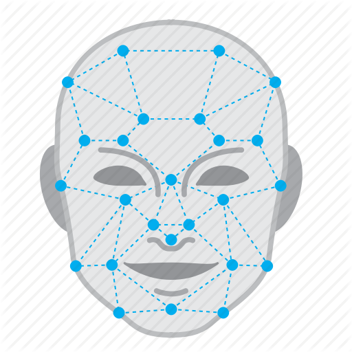
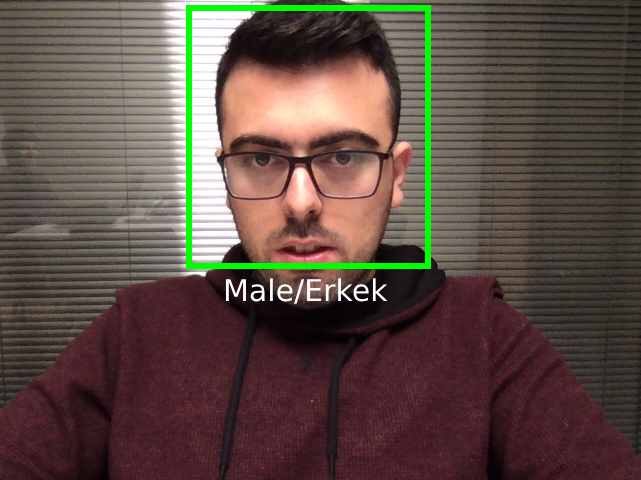

English | [Türkçe](./README.tr-TR.md)

<div align="center">

<h1 align="center">Gender Detection Using Deep Neural Network (DNN) with JavaCV Library</h1>



</div>

 

This example; captures the faces on the input image and makes the gender prediction. In doing so, he uses the trained caffe model as the classifier on the DNN package, which means "Deep Neural Network" of JavaCV, the Java wrapper of OpenCV. The trained model is under the *src/main/resources/*  directory.

### What is JavaCV?

JavaCV uses wrappers from the JavaCPP Presets of commonly used libraries by researchers in the field of computer vision (**OpenCV**, FFmpeg, libdc1394, PGR FlyCapture, OpenKinect, librealsense, CL PS3 Eye Driver, videoInput, ARToolKitPlus, flandmark, Leptonica, and Tesseract) and provides utility classes to make their functionality easier to use on the Java platform, including Android.

### JavaCV Maven

```
 <dependencies>
        <dependency>
            <groupId>org.bytedeco</groupId>
            <artifactId>javacv</artifactId>
            <version>1.2</version>
        </dependency>  

        <dependency>
            <groupId>net.coobird</groupId>
            <artifactId>thumbnailator</artifactId>
            <version>0.4.8</version>
        </dependency>

    </dependencies>
```


### How to Run?

- clone or download repository
```bash
git clone https://github.com/mesutpiskin/GenderClassification.git
```
- Create a Java Maven project with IDE and import source code and resources.
- Add the above bytecode-javacv reference to the Maven POM.XML file.
- Build project and run UICamera.java
- Happy hacking.


### Result



